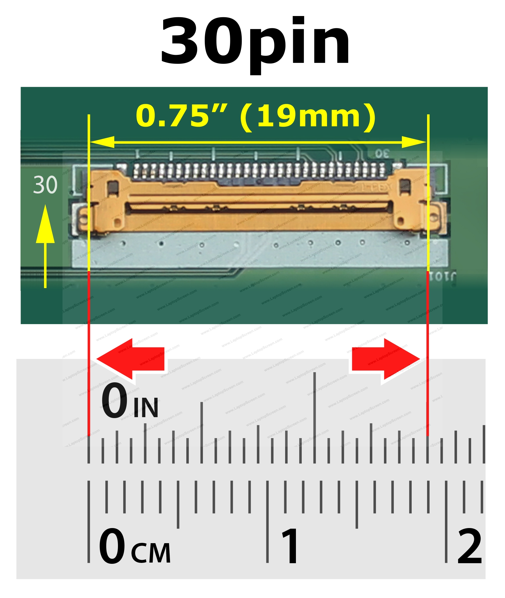
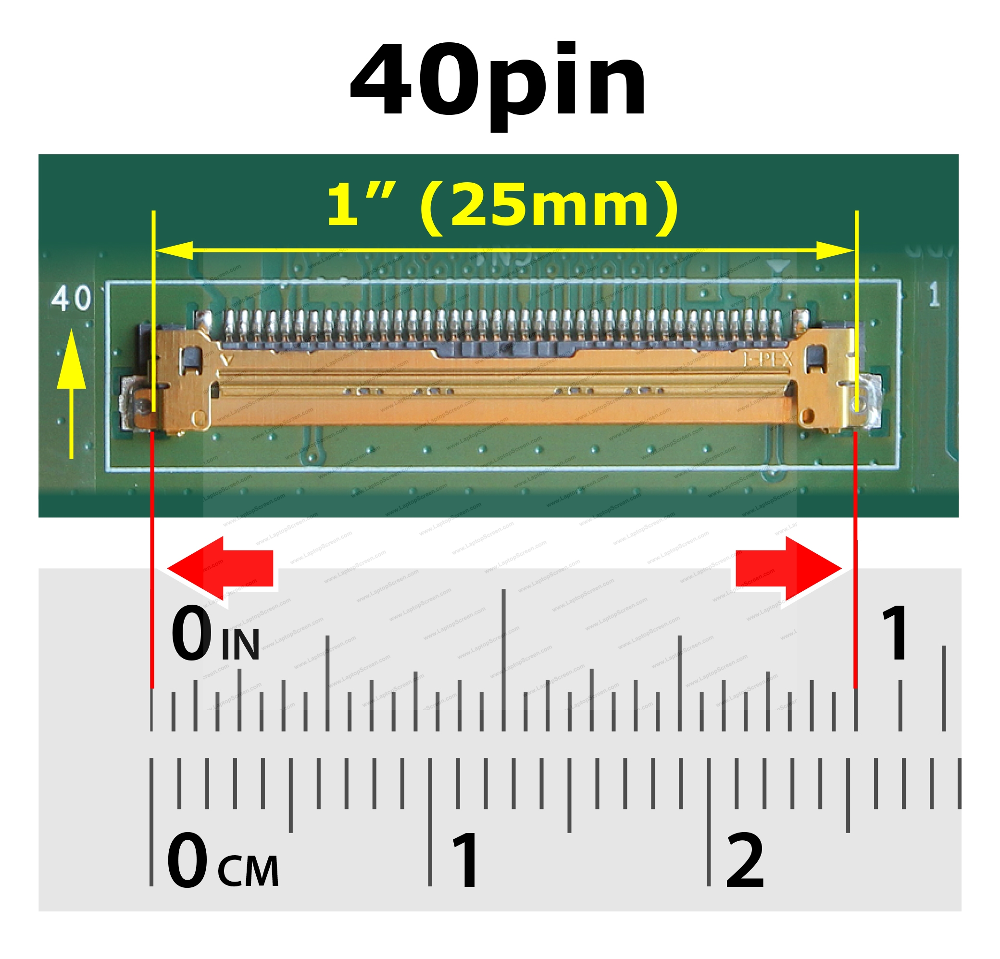
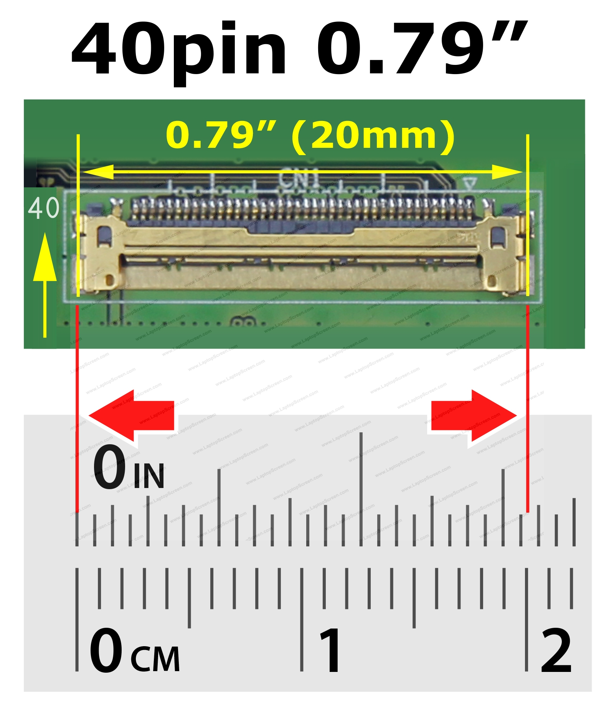
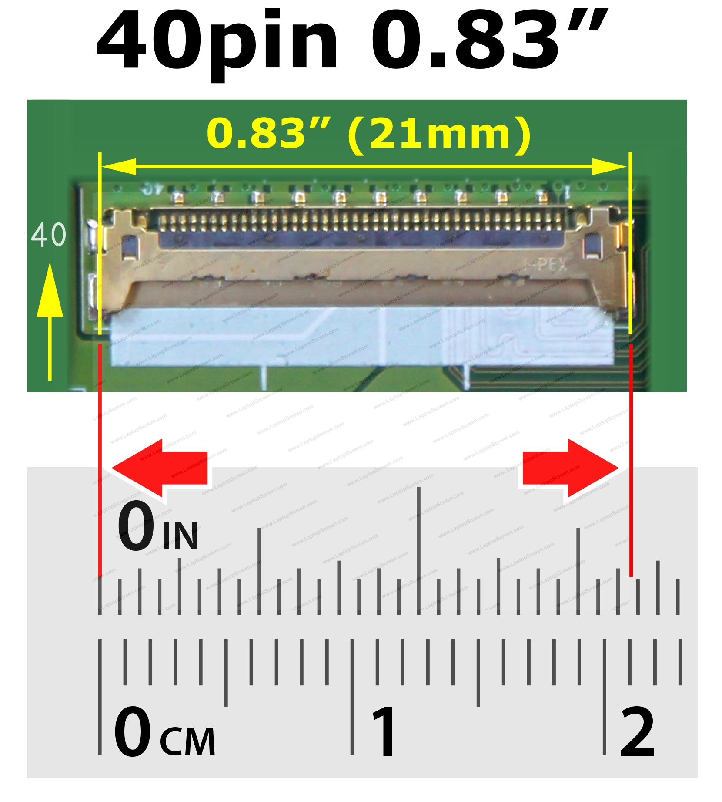

# Laptop Screen Connectors: A Modern Overview

Laptop screens use various types of video connectors, and in most cases, these connectors are not interchangeable due to differences in signaling and functionality. 

**Below are the most common types of connectors in use today:**

30-pin eDP (Embedded DisplayPort) Video Connector

Main modern connector used in laptops after 2014 without a touchscreen and supports resolution up to 1080p.

  

40-pin Video Connector can be 3 different incompatible types (due to different pinouts):

1. High-resolution QHD/UHD e

DP (Embedded DisplayPort) for laptops after 2015.

2. Touchscreen (eDP Touch) for laptops after 2015.

3. HD/FHD with LVDS (Low-Voltage Differential Signaling) older standard for laptops before 2015.

  

40-pin Narrow Video Connector Width: 0.79" (20mm) for Lenovo laptops with touchscreen (from 2018).

  

40-pin Narrow Video Connector Width: 0.83" (21mm) for laptops with High refresh rates (more than 60Hz).

  

Source :

https://www.laptopscreen.com/English/section/Articles/1245191276/Laptop%20Screen%20Connectors:%20A%20Modern%20Overview/
https://hackaday.io/project/179868-all-about-laptop-display-reuse
https://hackaday.io/project/179868-all-about-laptop-display-reuse/log/193081-common-lvds-laptop-panel-pinouts

https://www.laptop-lcd-screen.co.uk/blog/post/2023/11/22/a-comprehensive-guide-to-testing-lcd-screen-power-with-a-multimeter.aspx#/

Video:

https://www.pinterest.com/pin/laptop-lvds--981573681260268793/

https://repair-geeks.com/all-lcd-led-panel-datasheets-pdf-collection-download/
