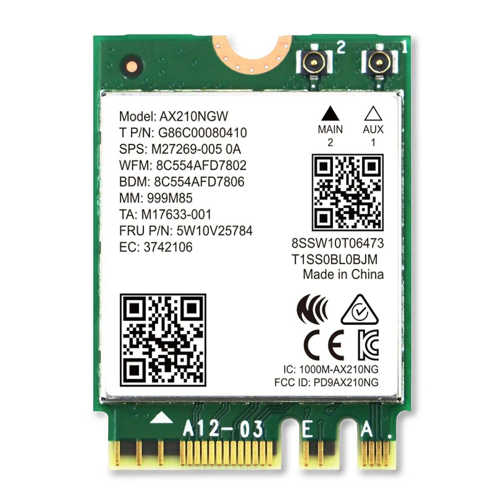

# Laptop Wifi Card

It depends on the specific WiFi module 

in most cases:

J2 (Main) is usually the black connector.
J1 (Aux) is usually the white connector.

If the sticker is confusing, check the module's datasheet or manufacturer documentation to confirm. 

  

